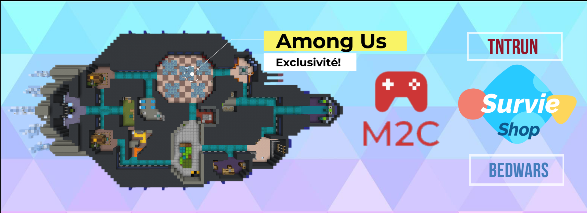

# Plugin Among Us
## Description
Ce plugin Minecraft permet de jouer à une version adaptée d'Among Us sur votre propre serveur Minecraft.

Imite toutes les fonctionnalités du jeu, qui comprend: 
- 2 équipes : l'équipage et les imposteurs
- 16 différentes tâches adaptées du jeu original
- 4 types de sabotage : Lumières, Oxygène, Réacteur et Communications
- Jusqu à 10 joueurs par partie
- 1 map disponible : The Skield
- Système de tâches communes et tâches visibles, et possibilité de "fausser" une tâche.
- Conduits de ventilation pour les imposteurs
- Réunion d'urgence et système de vote
- Possibilité de mourir et devenir un fantôme
- Personnalisation cosmétique dans le salon d'avant-match

## Utiliser 
Pour utiliser ce Plugin télécharger le fichier *Amongus.jar* situé à la racine du projet et glissez-le dans le répertoire de plugins de votre serveur. 
Version supportée : 1.16.2.

